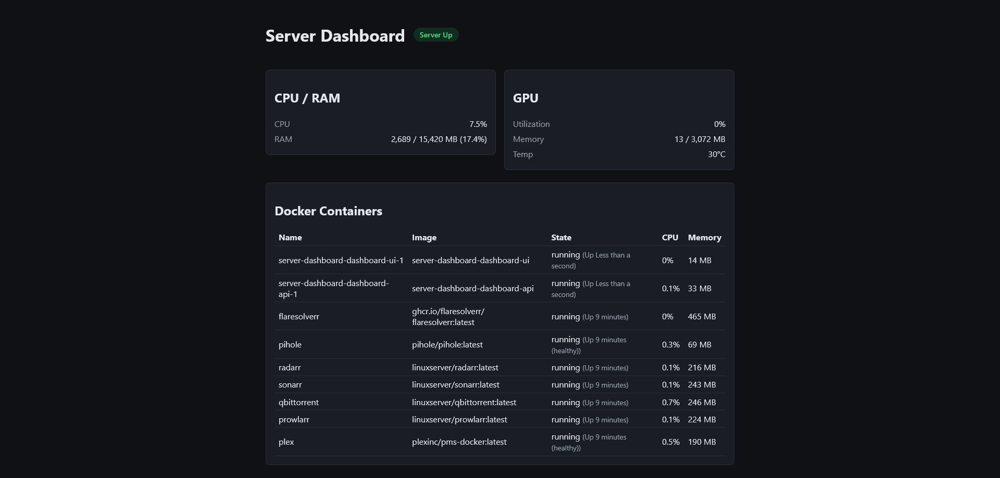

# server-dashboard

A self-hosted dashboard for a home Ubuntu server. It shows whether the server is up, live
CPU/RAM/GPU (NVIDIA) usage, and Docker container health — pushed to the browser in real
time. Built as a simpler, purpose-built alternative to running a full monitoring stack
(Grafana/Prometheus etc.) just to answer "is the server okay right now?" on a home network.



## Tech stack

- **Backend**: ASP.NET Core (.NET 8), running directly on the Ubuntu server it monitors so
  it can read `/proc`, shell out to `nvidia-smi`, and talk to the local Docker socket.
- **Frontend**: Angular (standalone components + signals).
- **Realtime**: SignalR pushes live metrics from the backend to the browser; a plain REST
  endpoint (`GET /api/status`) covers the client's first paint before the SignalR connection
  finishes negotiating.
- **Deployment**: Docker Compose, with an nginx reverse proxy in front of the Angular build.

## Architecture

Metric-collection services on the backend poll the system every few seconds — CPU/RAM from
`/proc`, GPU stats from `nvidia-smi`, container health from the Docker socket — and assemble
one snapshot of server state. That snapshot is broadcast to every connected browser over a
SignalR hub and also served over plain HTTP for the initial page load.

The dev laptop this is built on has no NVIDIA GPU and no Docker daemon, so GPU and Docker
metrics degrade gracefully to "unavailable" instead of crashing when those aren't present —
real end-to-end verification of those paths happens once deployed to the actual server.

See [CLAUDE.md](CLAUDE.md) for a fuller breakdown of the data flow and each service.

## Prerequisites

- [.NET 8 SDK](https://dotnet.microsoft.com/download/dotnet/8.0) — for the backend.
- [Node.js 22+](https://nodejs.org/) and npm 11+ — for the frontend (matches the version
  used in `frontend/server-dashboard-ui/Dockerfile`).
- Docker and Docker Compose — only needed for the deployment step below.
- An NVIDIA GPU with `nvidia-smi` on `PATH`, and a Docker daemon reachable — only needed for
  live GPU/container data; both degrade gracefully to "unavailable" when absent, which is
  the normal case on a Windows dev machine.

## Running it

### Backend

The .NET SDK isn't required to be on `PATH` — invoke it via full path if needed.

```
cd backend/ServerDashboard.Api
"C:\Program Files\dotnet\dotnet.exe" build
"C:\Program Files\dotnet\dotnet.exe" run
```

Listens on `http://localhost:5035` by default. `GET http://localhost:5035/api/status`
returns the current server snapshot as JSON. Swagger UI is available at `/swagger` in
Development.

Run the backend tests:

```
cd backend/ServerDashboard.Api.Tests
"C:\Program Files\dotnet\dotnet.exe" test
```

### Frontend

```
cd frontend/server-dashboard-ui
npm install
npm start
```

Serves the Angular dev server at `http://localhost:4200`, talking to the backend at
`http://localhost:5035` (CORS is opened for this origin in Development). Run `npm test` for
the frontend's Vitest suite.

### Deployment

On the target Ubuntu server, from the repo root:

```
docker compose up -d --build
```

This builds and runs two containers — `dashboard-api` and `dashboard-ui` (Angular served by
nginx, which reverse-proxies `/api` and `/hubs` to the API) — both on `network_mode: host` so
the API can reach the host's Docker socket and `nvidia-smi` without passthrough complexity.

## Future plans

v1 is intentionally live-only, unauthenticated, and LAN-only. Possible follow-ups:

- **Historical charting** — persist metrics over time (rather than just the latest snapshot)
  and show trends/graphs instead of only current values.
- **Auth / remote access** — add authentication so the dashboard could be safely exposed
  beyond the LAN (e.g. behind a VPN or a reverse proxy with login).
- **Alerting/notifications** — push a notification (email, Discord, ntfy, etc.) when
  CPU/RAM/GPU crosses a threshold or a container goes down.
- **Disk & network stats** — live disk usage/IO (`/proc/diskstats`) and network throughput
  (`/proc/net/dev`), following the same snapshot pattern as CPU/RAM.
